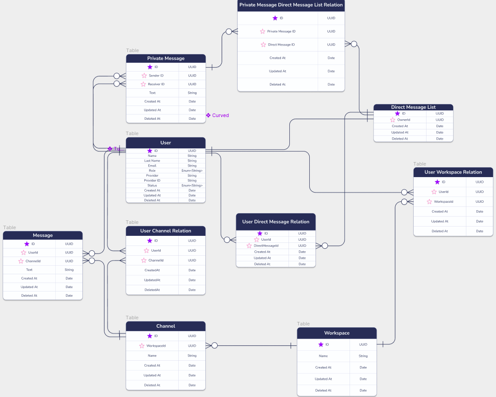

# Slack Clone
A clone of Slack using server-side rendering.

<!-- ABOUT THE PROJECT -->
## About The Project

This is a Slack like application that is built using server-side rendering. I was thinking about making a clone of an application that I have been using everyday. The reason why I chosed Slack is because it was the application that I was using daily at that time and working on a websocket application also seemed appealing to me. I was also going to have a challenge of using template engine to render the frontend. It is built on top of the [TypeScript](https://www.typescriptlang.org/), the [Express.js](https://expressjs.com/) framework, the [PostgreSQL](https://www.postgresql.org/) database and [Socket.IO](https://socket.io/).


## Database Diagram



For a better view of the database diagram, you can go to the [Figma](https://www.figma.com/file/oqKJ4M0Z2UkkIcCWeLhyIr/Slack-Database?node-id=0%3A1) page.


## Getting Started


### Installation

1. Clone the repo
   ```sh
   git clone https://github.com/mehmetfatiherdem/slack-clone.git
   ```
2. Navigate to the project folder

   ```sh
   cd slack-clone
   ```

3. Install dependencies
   ```sh
   npm i
   ```
4. Run the project
   ```sh
   npm run dev
   ```

## Features

- Creating Workspaces and Channels
- Inviting people to Workspaces with a link
- Sending and receiving messages in real time 
- Register/Login
  - Allow Google
- Authentication
  - JWT

### Built With

- [Node.js](https://nodejs.org/en/)
- [TypeScript](https://www.typescriptlang.org/)
- [Express.js](https://expressjs.com/)
- [PostgreSQL](https://www.postgresql.org/)
- [TypeORM](https://typeorm.io/)
- [ESLint](https://eslint.org/)
- [Socket.IO](https://socket.io/)
